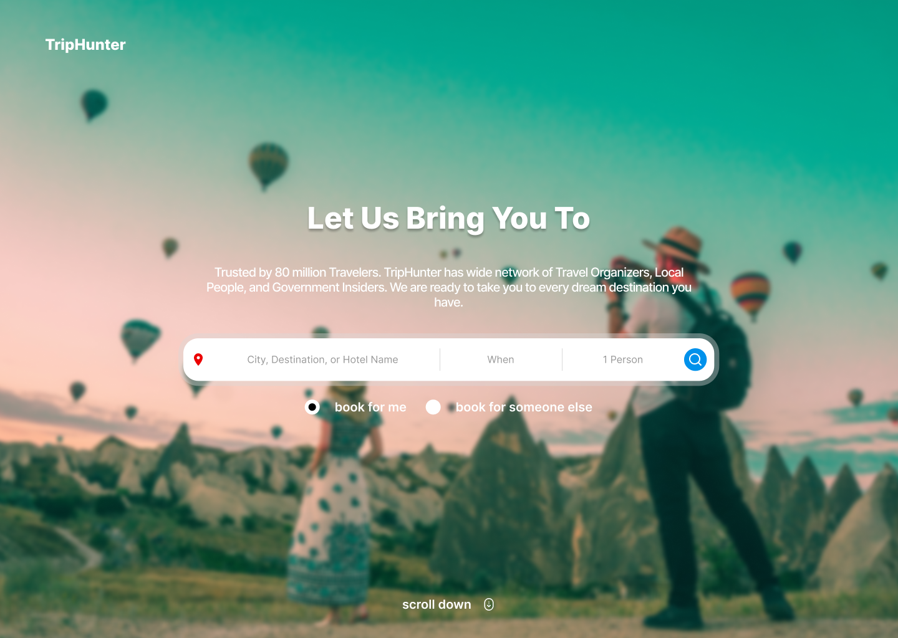

# TripHunter

This is going to be website for TripHunter.com, a trip planner aggregator website, where the user can find local trip organizers for their next dream trip. This website will acomodate everything for the trip, such as booking the perfect hotel, finding local guides, administrations, even insurance.

This is currently working in progress (WIP).

If you find any issue or have any feedback for the web page, feel free to submit an issue, or send me an email at ikosiriki@gmail.com.

Cheers 🍻

## Live Website
Open [this](https://module-1-dang0ta.vercel.app/) link for the live version of this project.

## Assignment Checklist

### Module 1
- [x] Basic HTML structure with HTML5 Semantic
- [x] Markdown Readme
- [x] CSS Flexbox
- [x] CSS Grid
- [x] Animated hamburger menu
- [x] Form input with type text
- [x] Form input with type textarea
- [x] Form input with type checkbox
- [x] Form input with type radio
- [x] Form submit button
- [x] Animations
- [x] Sticky navigation
- [x] Responsive view for Mobile
- [x] Responsive view for Tablet
- [x] Deployed somewhere
- [x] Optional interaction using Javascript
- [x] No framework

### Module 2
- [x]  apply custom font-face
- [x]  ensure there's text-shadow on some texts, and list-style on some list.
- [x]  ensure there's at least 1 background image, using either cover or contain.
- [ ]  apply asymetric grid somewhere in the page.
- [x]  ensure there's animate-based and transition-based animation on the page.
- [ ]  add technical documentation.
- [ ]  add deployment, custom domain, and configuration documentation to the Readme.
- [ ]  deploy the page to the internet using custom domain.
- [ ]  add screenshots for each major update to the page.
- [ ]  ensure the deployed page has at least 90 rating on Google Lighthouse.
- [ ]  add dark/light mode toggle.
- [ ]  create non-JS image carousel.

## Screenshot

## Disclaimer
The beautiful header background image is from [Unsplash](https://unsplash.com/photos/man-taking-photo-of-hot-air-balloons-eOcyhe5-9sQ), all credits for the image goes to [Mesut Kaya](https://unsplash.com/@directormesut).
